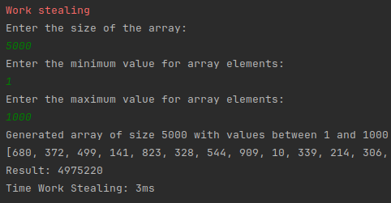
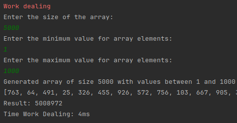

Цей проєкт демонструє реалізацію двох підходів до паралельного виконання задач Work Stealing та Work Dealing.

Було реалізовано обчислення попарної суми елементів великого одновимірного масиву та пошук файлів з певним розширенням у вказаній директорії.

Обидва завдання виконуються за допомогою Java з використанням Fork/Join Framework, ExecutorService, та пулу потоків

Work Stealing реалізовано за допомогою Fork/Join Framework. Задача розбивається на підзадачі, які автоматично розподіляються між потоками. Якщо один потік виконує свою частину роботи раніше, він може "вкрасти" задачу з черги іншого потоку.

Особливості цієї реалізації такі:

1. Клас RecursiveTask використовується для розбиття масиву на підмасиви.
2. Якщо підмасив менший за поріг THRESHOLD, обчислення виконується послідовно.
3. Інакше масив ділиться на дві частини, і для кожної частини створюється окрема задача

У Work Dealing задачі поділяються на окремі підзадачі і розподіляються між потоками з самого початку. Кожен потік виконує свою частину роботи незалежно.

Особливості такі:

1. Використовується ExecutorService для створення пулу потоків.
2. Масив розбивається на частини, які передаються в Callable задачі.
3. Результати виконання підзадач збираються через Future

